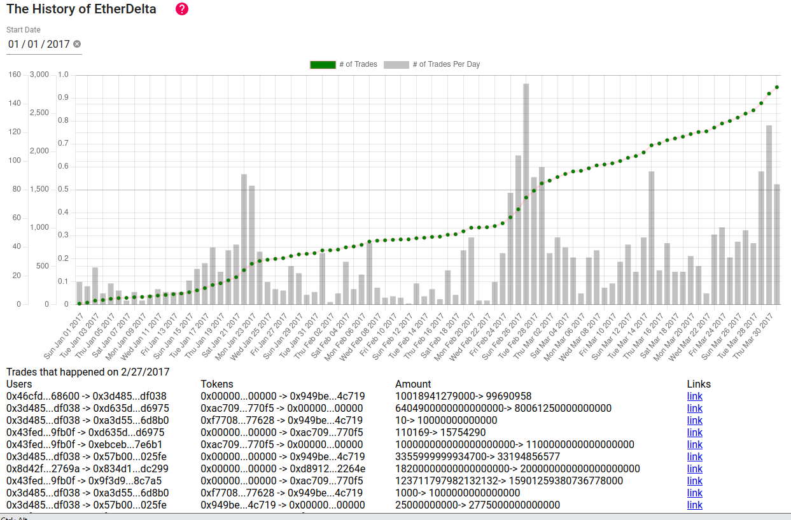

# History of EtherDelta

Subgraph has pulled data from the EtherDelta contracts such as Trades / Deposits and Withdrawals.

Frontend is able to see how has EtherDelta evolve through the CryptoCurrency Boom of 2017.

Clicking on the nodes on the graph will allow you to zoom into nodes and see the trades that occured for the day.
It will also link to etherscan.io if you want the more raw details.

## Diary
Sadly, I've only like 1-2 months of react experience and had a tough time trying to figure out the interaction between the examples that were given.

Lots of time was spent trying to debug the frontend implementation as well as trying to design an archetecture for theGraph

Gitcoin's Hackathon only spanned over 21 days and I started this project quite close to the deadline (5d).

Being a person with a day-job, I am only able to spend 2-3 hours a day on this project.

## Backend
https://thegraph.com/explorer/subgraph/antonyip/etherdelta

## FrontEnd
Refer to Readme in the frontend photos

## Screenshots of the project

